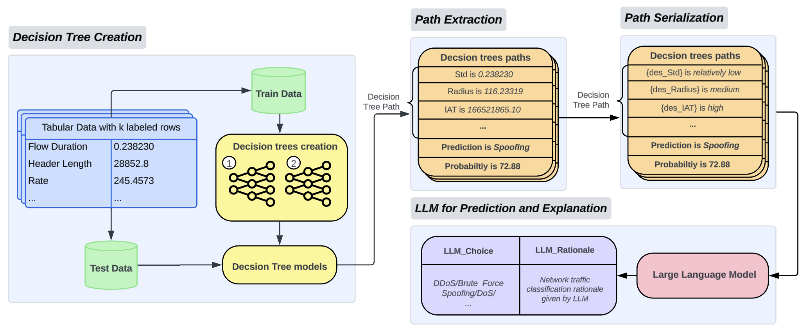

# Transforming Network Intrusion Detection Using Large Language Models

This repository contains the code implementation for the paper titled "Transforming Network Intrusion Detection Using Large Language Models." The project enhances network intrusion detection by integrating decision trees with large language models (LLMs) to improve classification accuracy and interpretability. It includes both complete and missing feature scenarios, demonstrating the robustness of various AI models. Examples from the GPT-1106-preview model are also provided to illustrate the performance and reasoning capabilities of the models in handling different network traffic types.

## Workflow Overview

This section provides an overview of the workflow used in this project, as illustrated in the flowchart below.



1. **Decision Tree Creation**:
    - The process begins with labeled tabular data containing various features related to network traffic.
    - Two decision trees are created using the training data. Each tree is independently trained with different random seeds, ensuring diversity in the decision-making process.

2. **Path Extraction**:
    - Once the decision trees are trained, paths from the root to the leaf nodes are extracted. These paths represent the decision-making process of each tree.
    - Each path is associated with a specific prediction and a confidence score, indicating the model's certainty in its prediction.

3. **Path Serialization**:
    - The extracted paths are serialized into a more interpretable format. For instance, numerical feature values are translated into descriptive levels.
    - This step helps in making the decision paths understandable, highlighting key features and their impact on the prediction.

4. **LLM for Prediction and Explanation**:
    - The serialized paths, along with the confidence scores, are fed into a Large Language Model (LLM) for final prediction and explanation.
    - The LLM analyzes the provided paths and generates a prediction for the type of network traffic. Additionally, it offers a rationale for its decision, ensuring transparency and interpretability in the classification process.

This workflow leverages the strengths of both decision trees and LLMs to provide accurate and explainable network traffic classification, as detailed in the paper "Transforming Network Intrusion Detection Using Large Language Models."

## Project Dependencies

- **python**: 3.11.7
- **scikit-learn**: 1.4.2
- **pandas**: 2.2.2
- **openai**: 1.10.0
- **numpy**: 1.26.3

## Experiment reproduction

### Test Dataset

For our experiments, we used a test set of 5,000 samples from the [CICIoT2023](https://www.unb.ca/cic/datasets/iotdataset-2023.html) dataset. This test set is used to evaluate the performance of our models in predicting and explaining network intrusion types.

### 8 Categories Network traffic prediction without missing features
Note: Two Different decision trees are already trained. For more setting details of Two different trees, please refer to:
1. 1st Decision tree: `dt_17.py`
2. 2nd Decision tree: `dt_2.py`

Both files are under `Code_Base/Unmissing_features/8_categories(decision tree + LLM)/Part1(Decision trees training + Path Extraction+Serialization)/script`

1. **Extract and Serialized decision tree paths of Two different decision trees with the default test file**

   Please goes to `Code_Base/Unmissing_features/8_categories(decision tree + LLM)/Part1(Decision trees training + Path Extraction+Serialization)/script`

   - For 1st decision tree: Run `path_search_revised_1.py`
   - For 2nd decision tree: Run `path_search_revised_2.py`

   Then, respective serialized files will be stored as `1_5000.csv` and `2_5000.csv` under `Code_Base/Unmissing_features/8_categories(decision tree + LLM)/Part1(Decision trees training + Path Extraction+Serialization)/processed`
2. **Form input quires for LLM**

   Please goes to `Code_Base/Unmissing_features/8_categories(decision tree + LLM)/Part2(Prompt formation + GPT_Response + Evaluation)/dt_compare_gpt-3.5-turbo-16k/dt_compare`
   
   Run `1.0-file_check.py` `1.1-input_file_integration.py` and `2.0-file_prep.py` in order. Then:
   
   - Form input quires with confidence score: Run `2.1-file_prep.py`, quries will be stored as `analysis_input_with_prob.jsonl` in the same folder.
   - Form input quries without confidence score: Run `2.2-file_prep.py`, quries will be stored as `analysis_input_without_prob.jsonl` in the same folder.
3. **Feed quries to LLM(take gpt-1106-preview as example), and evaluate performance**

   Run `parallel_request.py` under `Code_Base` folder, using the quries file above, example commands could be like following:

   ```python parallel_request.py /path/to/analysis_input_with_prob.jsonl /path/to/analysis_input_with_prob_results.jsonl```
   ```python parallel_request.py /path/to/analysis_input_without_prob.jsonl /path/to/analysis_input_without_prob_results.jsonl```

   Then, for our scenario, LLM responses will be stored in `analysis_input_with_prob_results.jsonl` for scenario with confidence score provided, and `analysis_input_without_prob_results.jsonl` for scenario without confidence socre provided.

   Please Note:
   - parallel_request.py only supports gpt-3.5-turbo, gpt-3.5-turbo-16k, gpt-4-1106-preview and gpt-4-0125-preview for now.
   - Please replace your openai key in Line 470 in `parallel_request.py`

4. **Evaluate LLM performance**

   Please go to `Code_Base/Unmissing_features/8_categories(decision tree + LLM)/Part2(Prompt formation + GPT_Response + Evaluation)/dt_compare_gpt-3.5-turbo-16k/dt_compare`

   Run `2.3-file_integration.py`, `2.4-file_integration.py` and `3.0-evaluation.py`

   Please Note:
   - The default naming evluation process is for scenario without confidence score. If evaluation for the scenario with confidence score provided is prefereed, please change `without` to `with` in every file path string in `2.3-file_integration.py`, `2.4-file_integration.py` and `3.0-evaluation.py`
### 8 Categories Network traffic prediction with missing features, take missing 1 features as Example
Note: Two Different decision trees are already trained. For more setting details of Two different trees, please refer to:
1. 1st Decision tree: `dt_17.py`
2. 2nd Decision tree: `dt_2.py`

Both files are under `Code_Base/Missing_features/Part1(Decision trees training + Path Extraction+Serialization)/script`

If other number of missing features is preferred, please change the number in `selected_features = random.sample(all_features, 1)` in `find_paths_1.ipynb` and `find_paths_2.ipynb`accordingly.
1. **Extract and Serialized decision tree paths of Two different decision trees with the default test file**

   Please goes to `Code_Base/Unmissing_features/8_categories(decision tree + LLM)/Part1(Decision trees training + Path Extraction+Serialization)/script`

   - For 1st decision tree: Run `find_paths_1.ipynb`
   - For 2nd decision tree: Run `find_paths_2.ipynb`

   Then, respective serialized files will be stored as `dt_1_1_missing.json` and `dt_2_1_missing.json` under `Code_Base/Missing_features/Part1(Decision trees training + Path Extraction+Serialization)/missing_feature/1_missing`
2. **Form input quires for LLM**

   Please goes to `Code_Base/Missing_features/Part2(Prompt formation + GPT_Response + Evaluation)/dt_compare_missing_features_miss1`
   
   Run `0.0-file_integration.py` `1.1-input_file_integration.py` `1.2-rep.py` `1.3-rep.py` and `2.0-file_prep.py` in order. Then:
   
   Input quries will be stored as `analysis_input.jsonl` in `Code_Base/Missing_features/Part2(Prompt formation + GPT_Response + Evaluation)/dt_compare_missing_features_miss1/output`

3. **Feed quries to LLM(take gpt-1106-preview as example), and evaluate performance**

   Run `parallel_request.py` under `Code_Base` folder, using the quries file above, example commands could be like following:

   ```python parallel_request.py /path/to/analysis_input.jsonl /path/to/analysis_input_results.jsonl```

   Then, for our scenario, LLM responses will be stored in `analysis_input_results.jsonl`
4. **Evaluate LLM performance**

   Please go to `Code_Base/Missing_features/Part2(Prompt formation + GPT_Response + Evaluation)/dt_compare_missing_features_miss1`

   Run `2.1-file_integration.py`, `2.2-file_integration.py` and `3.0-evaluation.py` in order

## GPT Response Examples
For some of the gpt-1106-preview please refers to `https://github.com/Dongming1010/IDS-LLM/blob/main/Detection_Reasoning_Examples.md`
